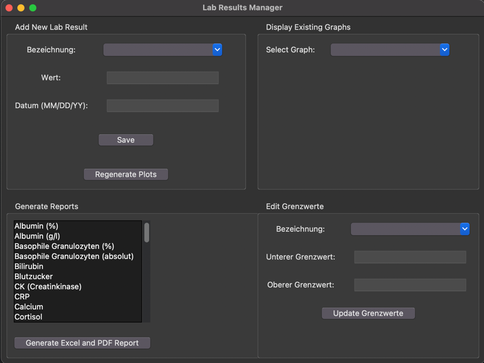

# Lab Results Manager

## Overview

The Lab Results Manager is a Python-based application designed to help you manage and visualize medical lab results (e.g. from blood tests) efficiently while keeping all data and processing locally on the machine.

The script allows you to add new lab entries, update measurement norm values (`Grenzwerte`), generate plots, and export reports in both Excel and PDF formats. The application ensures that all date values are consistently managed in the `mm/dd/yy` format, maintaining data integrity throughout the workflow.

UI:

## Features

- **Add New Lab Results**: Easily input new lab data, including measurement type (`Bezeichnung`), value (`Wert`), date (`Datum`), and measurement unit (`Einheit`).
- **Update Measurement Boundaries**: Edit the lower (`unterer Grenzwert`) and upper (`oberer Grenzwert`) boundaries for any measurement type.
- **Generate Plots**: Automatically generate and regenerate plots for each measurement type, visualizing how values change over time.
- **Export Reports**: Export data and plots to Excel and PDF formats, with customized options for selecting specific measurement types.
- **Date Handling**: Consistent date formatting throughout the application, ensuring that all dates are stored and displayed in the `mm/dd/yy` format.

## Requirements

- Python 3.8 or higher
- Required Python packages:
  - `pandas`
  - `matplotlib`
  - `openpyxl`
  - `fpdf`
  - `Pillow`

## Installation

1. Clone the repository:
    ```bash
    git clone https://github.com/your-username/lab-results-manager.git
    ```
2. Navigate to the project directory:
    ```bash
    cd lab-results-manager
    ```
3. Install the required packages:
    ```bash
    pip install -r requirements.txt
    ```

## Usage

1. **Run the Application**:
   - Execute the `LabDataManagerUI.py` script to launch the application:
     ```bash
     python LabDataManagerUI.py
     ```

2. **Add New Lab Results**:
   - Use the "Add New Lab Result" section to input new lab data.
   - Choose an existing `Bezeichnung` or create a new one.
   - Enter the measurement `Wert`, `Datum` (in `mm/dd/yy` format), and `Einheit`.

3. **Edit Grenzwerte**:
   - Select a `Bezeichnung` from the dropdown in the "Edit Grenzwerte" section.
   - View existing `unterer Grenzwert` and `oberer Grenzwert` values, if any, and modify them as needed.
   - Click "Update Grenzwerte" to apply the changes across all relevant entries.

4. **Generate Plots**:
   - Click "Regenerate Plots" to create or update the plots for all measurement types.
   - The plots are saved in the `plots` directory.

5. **Export Reports**:
   - Use the "Generate Reports" section to select the measurements you want to include in the report.
   - Generate an Excel and PDF report, which will include the selected data and plots.

## File Structure

- `LabDataManagerUI.py`: Main application file with the UI.
- `Functions.py`: Contains all the core functions used in the application, including data sanitization, plotting, and exporting.
- `lab_results_aug24.csv`: Sample CSV file used to store lab results.
- `plots/`: Directory where generated plots are saved.
- `lab_results_report.xlsx`: Generated Excel report.
- `lab_results_report.pdf`: Generated PDF report.

## Date Handling

All dates within the application are handled in the `mm/dd/yy` format to ensure consistency. This format is enforced when importing, exporting, and processing data.

## Logging

The application includes detailed logging for all function calls, helping to trace operations and debug if necessary. Logs include function names, arguments, and return values.

## License

This project is licensed under the MIT License. See the `LICENSE` file for details.

## Contributing

Contributions are welcome! Please feel free to submit a pull request or open an issue with any suggestions or improvements.

