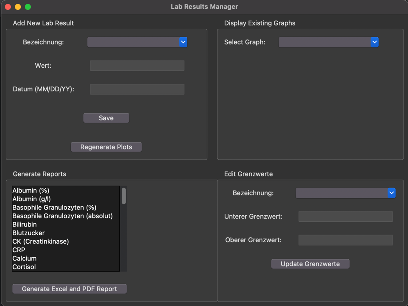

# Lab Results Manager

> A Python-based desktop application for managing and visualizing medical lab results



## Overview

The Lab Results Manager is a Python desktop application designed to help you manage and visualize medical lab results (e.g., from blood tests) efficiently while keeping all data and processing locally on your machine. Track your health metrics over time, visualize trends, and generate professional reports—all with complete privacy.

## Features

- ✅ **Add New Lab Results** - Easily input new lab data with measurement type, value, date, and unit
- ✅ **Update Reference Ranges** - Edit normal value boundaries (Grenzwerte) for any measurement type
- ✅ **Generate Time-Series Plots** - Automatically visualize how values change over time with normal range overlays
- ✅ **Export Reports** - Export data and plots to Excel and PDF formats with customizable selections
- ✅ **Display Graphs** - View existing plots directly in the application
- ✅ **Date Handling** - Consistent date formatting (mm/dd/yy) throughout the application
- ✅ **Privacy-First** - All data stored locally, no cloud dependencies

## Requirements

- Python 3.8 or higher
- Required Python packages:
  - `pandas` - Data manipulation
  - `matplotlib` - Plotting and visualization
  - `openpyxl` - Excel export
  - `fpdf` - PDF generation
  - `Pillow` - Image handling

## Installation

1. Clone the repository:
   ```bash
   git clone https://github.com/JuMaD/HealthTracker.git
   cd HealthTracker
   ```

2. Install the required packages:
   ```bash
   pip install pandas matplotlib openpyxl fpdf Pillow
   ```

   Or using a requirements file:
   ```bash
   pip install -r requirements.txt
   ```

## Usage

1. **Run the Application**:
   ```bash
   python LabDataManagerUI.py
   ```

2. **Add New Lab Results**:
   - Use the "Add New Lab Result" section
   - Choose an existing measurement type (`Bezeichnung`) or create a new one
   - Enter the measurement value (`Wert`), date (`Datum` in mm/dd/yy format), and unit (`Einheit`)
   - Click "Save" to store the result

3. **Edit Reference Ranges (Grenzwerte)**:
   - Select a measurement type from the dropdown in the "Edit Grenzwerte" section
   - View existing lower (`unterer Grenzwert`) and upper (`oberer Grenzwert`) values
   - Modify them as needed
   - Click "Update Grenzwerte" to apply changes across all entries

4. **Generate Plots**:
   - Click "Regenerate Plots" to create or update plots for all measurement types
   - Plots are saved in the `plots/` directory

5. **Display Graphs**:
   - Select a measurement from the "Display Existing Graphs" dropdown
   - View the time-series plot directly in the application

6. **Export Reports**:
   - Use the "Generate Reports" section
   - Select the measurements to include (multi-select with Ctrl/Cmd)
   - Click "Generate Excel and PDF Report"
   - Reports are saved as `lab_results_report.xlsx` and `lab_results_report.pdf`

## File Structure

```
HealthTracker/
├── LabDataManagerUI.py         # Main application with GUI
├── Functions.py                # Core business logic functions
├── lab_results_aug24.csv       # Data storage (created on first run)
├── plots/                      # Generated PNG plots
├── img.png                     # Application screenshot
├── next.md                     # Planned features
├── ARCHITECTURE_REVIEW.md      # Detailed architecture analysis and recommendations
├── CLAUDE.md                   # Development guidelines for AI assistants
├── LICENSE                     # MIT License
└── README.md                   # This file
```

## Architecture & Modernization

This application works well but has room for improvement. For a comprehensive analysis of the current architecture and detailed recommendations for modernization, see:

**[ARCHITECTURE_REVIEW.md](./ARCHITECTURE_REVIEW.md)** - Includes:
- Current architecture assessment
- Strengths and weaknesses analysis
- Modernization recommendations (SQLite, modern UI, web version)
- Implementation roadmap
- Priority improvements ranked by impact

### Key Improvement Opportunities

1. **Migrate to SQLite** - Better data integrity and query capabilities
2. **Modernize UI** - Use CustomTkinter or move to web interface (Streamlit)
3. **Automated Backups** - Prevent data loss
4. **Separate Reference Values** - Better management with source citations
5. **Multilanguage Support** - Expand beyond German/English
6. **Enhanced Visualization** - Interactive plots with Plotly
7. **CSV Import** - Import data from other sources
8. **Standalone Distribution** - Package as executable with PyInstaller

See [ARCHITECTURE_REVIEW.md](./ARCHITECTURE_REVIEW.md) for detailed implementation guidance.

## Planned Features

From [next.md](./next.md):
- Import CSV functionality with column mapping
- Multi-language support for column names
- Independent reference value management with citations
- User-selectable reference ranges from multiple sources
- Package as Windows and Mac applications
- Improved time-series display (aspect ratio fixes)
- Dummy data for documentation examples

## Data Format

Data is stored in CSV format with the following fields:

| Field | Description | Example |
|-------|-------------|---------|
| Bezeichnung | Measurement type | Hemoglobin, Glucose |
| Einheit | Unit | g/dL, mg/dL |
| Wert | Measured value | 15.2, 95 |
| Datum | Date (mm/dd/yy) | 08/15/24 |
| unterer Grenzwert | Lower normal range | 13.5 |
| oberer Grenzwert | Upper normal range | 17.5 |

All dates are handled in `mm/dd/yy` format to ensure consistency.

## Privacy & Security

- ✅ **Local Storage** - All data stays on your computer
- ✅ **No Cloud Dependencies** - Works completely offline
- ✅ **No Data Sharing** - Your health data is yours alone
- ✅ **Open Source** - Review the code yourself

## Development

### Running Tests

(Tests to be added - see ARCHITECTURE_REVIEW.md for recommendations)

### Contributing

Contributions are welcome! Please:

1. Read [CLAUDE.md](./CLAUDE.md) for development guidelines
2. Check [ARCHITECTURE_REVIEW.md](./ARCHITECTURE_REVIEW.md) for planned improvements
3. Create a feature branch
4. Submit a pull request

### Development Guidelines

See [CLAUDE.md](./CLAUDE.md) for:
- Code conventions
- Development workflows
- AI assistant guidelines
- Testing standards

## Logging

The application includes detailed logging for all function calls via the `@log_function_call` decorator. This helps trace operations and debug issues. Logs include function names, arguments, and return values.

## License

This project is licensed under the MIT License - see the [LICENSE](LICENSE) file for details.

## Support

- **Issues**: Use the [GitHub Issues](https://github.com/JuMaD/HealthTracker/issues) page
- **Discussions**: Join [GitHub Discussions](https://github.com/JuMaD/HealthTracker/discussions)

## Roadmap

**Current Version:** Python desktop application with Tkinter

**Future Versions:**
- v2.0: SQLite database, modern UI (CustomTkinter)
- v3.0: Web-based interface (Streamlit/Flask)
- v4.0: Mobile support, cloud backup options

See [ARCHITECTURE_REVIEW.md](./ARCHITECTURE_REVIEW.md) for the complete modernization roadmap.

---

**Built with ❤️ for better health tracking and data privacy**

*Your health data should be yours, stored locally, and under your complete control.*
